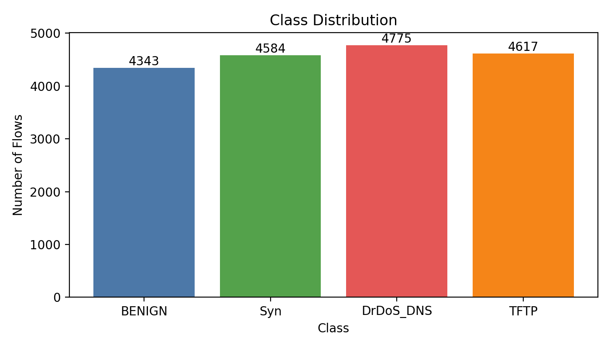
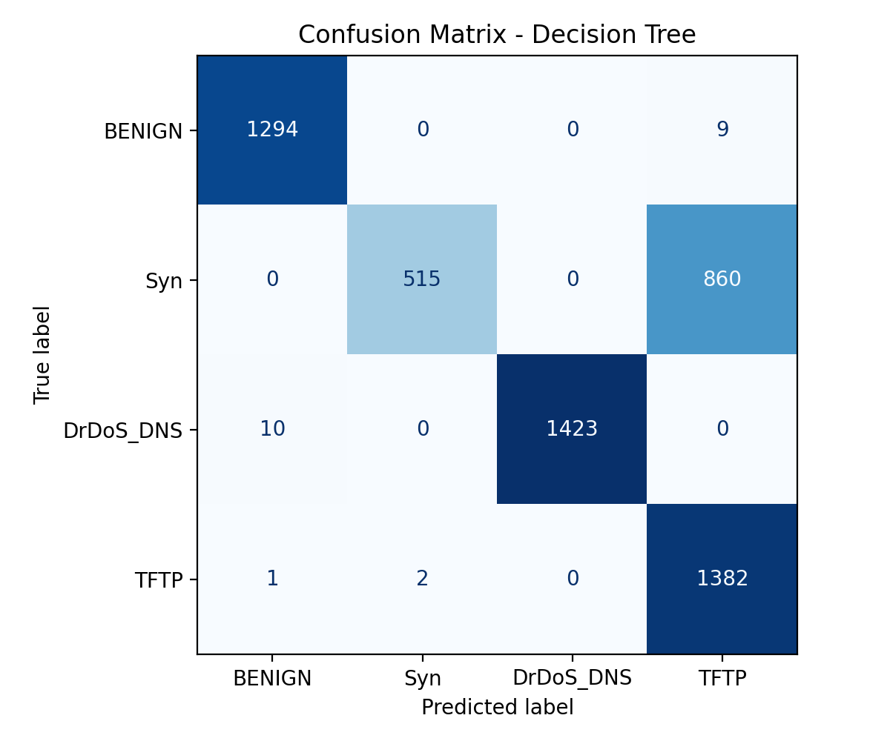
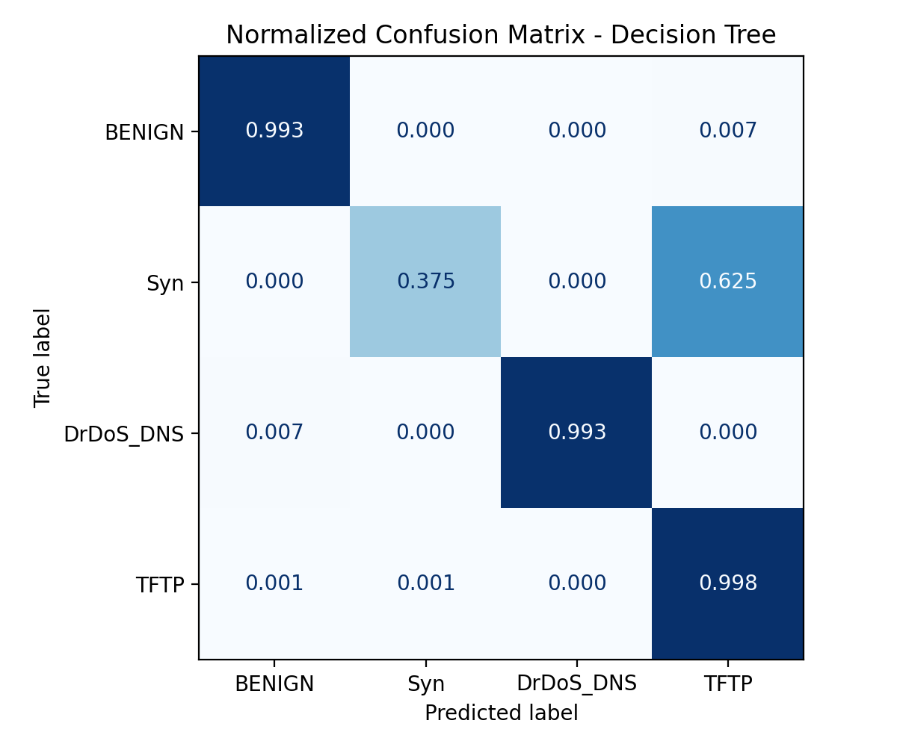
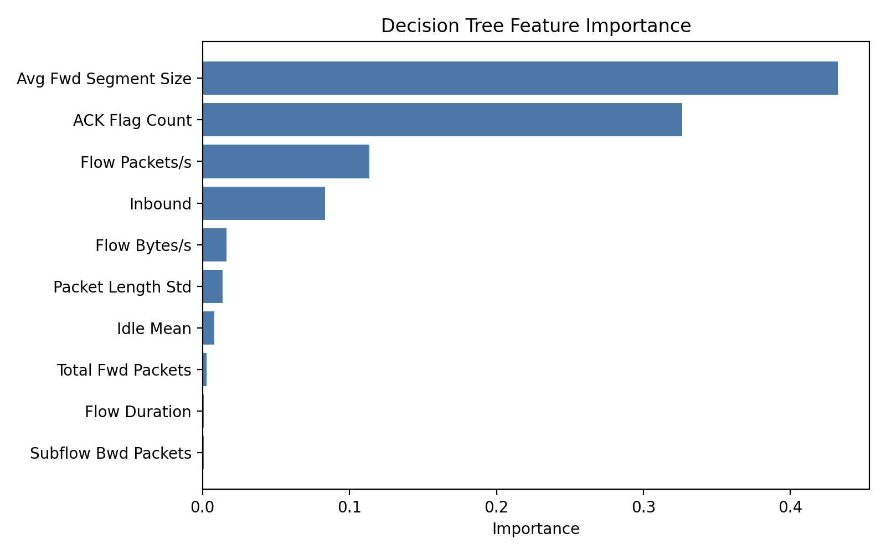
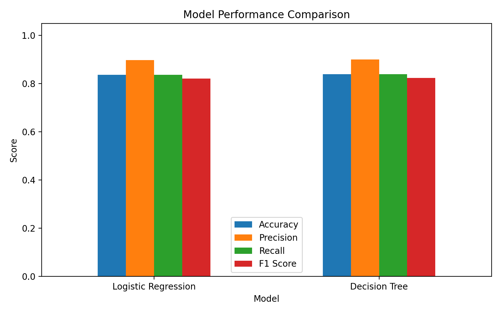

<h3 align="center">CIC-DDoS2019 NIDS Classifier</h3>
<p align="center">Machine learning based network intrusion detection for a university cybersecurity assignment</p>

---

## Project Overview

This project is a machine learning based Network Intrusion Detection System (NIDS) that classifies network traffic flows using a subset of the **CIC-DDoS2019** dataset.

The current version uses four classes:
- `BENIGN`
- `Syn`
- `DrDoS_DNS`
- `TFTP`

## How it works

**Dataset selection**
- The script reads three CIC-DDoS2019 CSV files: `Syn.csv`, `DrDoS_DNS.csv`, and `TFTP.csv`
- It collects `BENIGN` rows that already exist inside those files
- Because the original dataset is very large, the script samples a smaller subset so it can be trained locally without needing extreme compute or storage
- It keeps useful numeric flow features such as packet counts, flow duration, flag counts, packet length statistics, and inbound traffic indicators

**Training**
- The dataset is cleaned by converting feature values into numbers and removing invalid values such as missing entries or infinite values
- The traffic labels are converted into class IDs so the machine learning models can work with them
- The data is split into training and testing sets
- The training set is used to teach the models patterns in the network traffic
- The testing set is kept separate so the final results show how well the models perform on unseen data
- Two machine learning models are trained:
  - Logistic Regression
  - Decision Tree

**Evaluation**
- Both models are evaluated using accuracy, precision, recall, and F1 score
- Confusion matrices are saved to show which classes are being predicted correctly and which classes are being confused with each other
- Normalized confusion matrices are saved so the class-by-class performance is easier to compare
- A class distribution chart is saved to show how many rows belong to each traffic class
- A Decision Tree feature importance chart is saved to show which flow features had the biggest influence on the classifier
- A model comparison chart is saved in the `output` folder so the two methods can be compared visually

## Dataset

This repository does **not** include the full training dataset because the source files are too large for GitHub.

Dataset source used for this project:
- [Kaggle mirror](https://www.kaggle.com/datasets/rodrigorosasilva/cic-ddos2019-30gb-full-dataset-csv-files)

Original dataset source:
- [CIC-DDoS2019 by the Canadian Institute for Cybersecurity (CIC)](https://www.unb.ca/cic/datasets/ddos-2019.html)

After downloading the dataset, place these files inside `training data/`:
- `Syn.csv`
- `DrDoS_DNS.csv`
- `TFTP.csv`

## Stack

- **Language**: Python
- **Data processing**: pandas, numpy
- **Machine learning**: scikit-learn
- **Visualisation**: matplotlib
- **Dataset**: CIC-DDoS2019 flow based CSV files

## Results

| Model | Accuracy | Precision | Recall | F1 Score |
|---|---:|---:|---:|---:|
| Logistic Regression | 0.8368 | 0.8975 | 0.8370 | 0.8207 |
| Decision Tree | 0.8395 | 0.9004 | 0.8396 | 0.8234 |

The Decision Tree performed slightly better overall, while both models showed that some attack classes were easier to detect than others.

## Output Visuals

### Class Distribution



### Logistic Regression Confusion Matrix


### Decision Tree Confusion Matrix



### Normalised Logistic Regression Confusion Matrix


### Normalised Decision Tree Confusion Matrix



### Decision Tree Feature Importance



### Model Performance Comparison



## Project Structure

```text
|-- ids_project.py
|-- README.md
|-- requirements.txt
|-- training data/
|   |-- Syn.csv
|   |-- DrDoS_DNS.csv
|   `-- TFTP.csv
`-- output/
    |-- class_distribution.png
    |-- confusion_matrix_decision_tree.png
    |-- confusion_matrix_logistic_regression.png
    |-- decision_tree_feature_importance.png
    |-- labelled_ids_dataset.csv
    |-- model_performance_comparison.png
    |-- model_results_summary.csv
    |-- normalized_confusion_matrix_decision_tree.png
    `-- normalized_confusion_matrix_logistic_regression.png
```

## Running the project

1. Install the required Python packages:

```bash
pip install -r requirements.txt
```

2. Download the required dataset files and place them in `training data/`.

3. Run the script from the project root:

```bash
python ids_project.py
```

4. Check the generated graphs and CSV files in the `output` folder.
